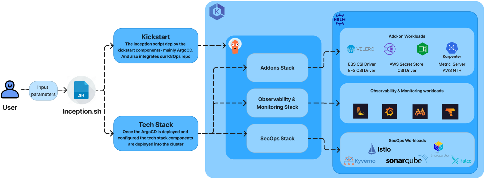

# DevOptymize_K8Ops

## PREREQUISITE
- An AWS account with the EKS cluster and other aws infra like IAM roles and s3 buckets which are pre-requisites for the techstack components of the customer choice.

## OVERVIEW
- In this DevOptymize_K8Ops repo, we have helm files, ArgoCD application manifest files, techstack components and the shell scripts. The repo is designed in such a way that each components are categorized into respective folders for ease of understanding, usage and maintenance.

- The scripts folder has the inception.sh script which acts as the controller for the entire repo/framework. It helps us to deploy and configure ArgoCD into the the desired EKS cluster and then configure the cluster with techstack components of our choice leavergaing ArgoCD.

- The script also helps us in installing the aws cli, connecting to the eks cluster etc, which all are prerequisites for running the framework.

- Once we connect to the cluster and deploy ArgoCD, then we are good to deploy the required components. 

- For details please do go thorugh the below sections.

## HOW IT WORKS !

- The entire framework is controlled by the master script which is the [insecption.sh](./scripts/inception.sh) script. Refer to the [readme](./scripts/README.md) to undertanding the commands used for running the script to invoke various functions which will help us to deploy and configure the EKS cluster with devoptymize k8s components.

- Once we connect the cluster with the help pof ou script we are all good to deploy components. The first one is to deploy the ArgoCD. The helm harts and values.yaml files for deploying ArgoCD is present in the [kickstart](./gitops/argocd/kickstart/argocd) folder. The script deploys ArgoCD and also does th eintegration with the GitHub repo also.

- Once the ArgoCD is deployed and configured we are good to deploy our K8s components into the cluster. We have the [techstack](./gitops/argocd/techstack) folder handling the deployment of the desired components. We have grouped our Techstack into 3 - addon, secops & observaility-monitoring. Techstack deploys 3 ArgoCD applications each for addon, secops & observaility-monitoring, this inture deploys ArgoCD applications of the K8s components. The ArgoCD application manifest files for the k8s components are present in the [argoapps](./gitops/argocd/argoapps/aws/env) folder.

- In overall the we need to run the shell script with pre-defined variables to connect with the cluster, then deploy the ArgoCD into the connected cluster. And to deploy the techstack components into cluster which then creates ArgoCD application of each components.

# FOLDER AND FILE STRUCTURE

## gitops/argocd:

- [argoapps](./gitops/argocd/argoapps/aws/env) folder contains application values.yaml files, which is used to create apps into the argocd for all the techstack components (Addons, SecOps and Observability monitoring).

- [helm](./gitops/argocd/helm) folder contains the all values.yaml files and chart files for AddOns, SecOps and Observability monitoring stack.

- [kickstart](./gitops/argocd/kickstart/argocd) folder conatins the values.yaml file and chart file for deploying argocd into the cluster.

- [techstack](./gitops/argocd/techstack) folder contains chart file and values.yaml files for AddOns, SecOps and Observability monitoring stack, which helps to deploy the stack components at once into the cluster.

## scripts:

- [scripts](./scripts) folder has [insecption.sh](./scripts/inception.sh) file, which is the shell script for deploying Argo CD into the connected cluster then deploy techstack components into the cluster and which also creates the deployed components application into the Argo CD. By running the shell script with pre-defined variables this can be performed.

